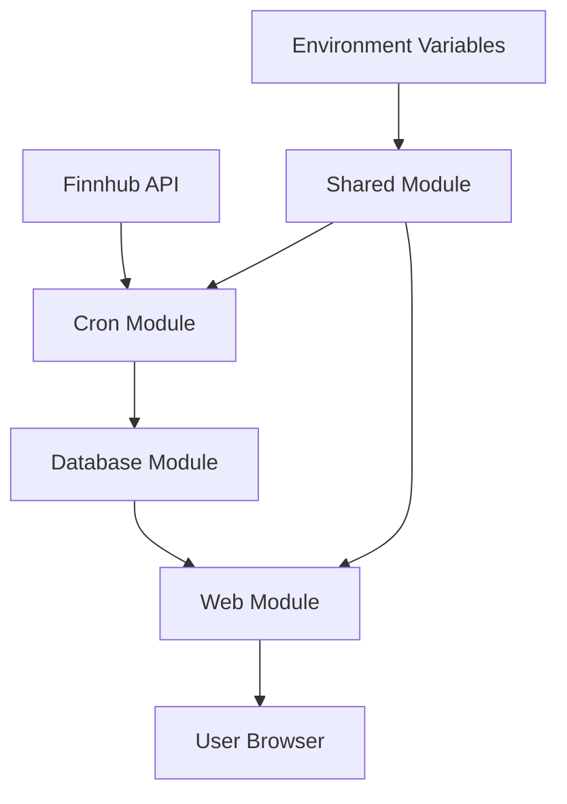

# Architektúra aplikácie

## Prehľad

EarningsTable je modulárna aplikácia pre zobrazenie a správu earnings dát z Finnhub API.

## Modulárna štruktúra

```
EarningsTable/
├── modules/
│   ├── database/          # Databázový modul
│   ├── cron/             # Cron joby
│   ├── web/              # Web aplikácia
│   ├── shared/           # Zdieľané funkcie
│   └── docs/             # Dokumentácia
├── .env                  # Environment premenné
├── .gitignore           # Git ignore
└── package.json         # Hlavný package.json
```

## Moduly

### 1. Database Module (`modules/database/`)

**Úloha:** Správa databázy a Prisma ORM

**Komponenty:**

- `prisma/schema.prisma` - databázová schéma
- `prisma/migrations/` - migračné súbory
- `package.json` - Prisma dependencies

**Zodpovednosti:**

- Definícia databázovej schémy
- Migrácie
- Prisma Client generovanie

### 2. Cron Module (`modules/cron/`)

**Úloha:** Načítavanie dát z Finnhub API

**Komponenty:**

- `src/cron.ts` - hlavný cron job
- `src/run-once.ts` - jednorazové načítanie
- `src/finnhub.ts` - Finnhub API integrácia
- `src/repository.ts` - databázové operácie
- `src/config.ts` - konfigurácia

**Zodpovednosti:**

- Plánované načítavanie dát
- API komunikácia s Finnhub
- Ukladanie dát do databázy

### 3. Web Module (`modules/web/`)

**Úloha:** Webové rozhranie a API

**Komponenty:**

- `src/web.ts` - Express server
- `src/repository.ts` - databázové operácie
- `src/config.ts` - konfigurácia

**Zodpovednosti:**

- HTTP server
- HTML rozhranie
- REST API endpoints
- Zobrazenie dát

### 4. Shared Module (`modules/shared/`)

**Úloha:** Spoločné funkcie a typy

**Komponenty:**

- `src/types.ts` - TypeScript typy
- `src/config.ts` - centralizovaná konfigurácia
- `src/utils.ts` - utility funkcie

**Zodpovednosti:**

- Typy pre celú aplikáciu
- Spoločná konfigurácia
- Utility funkcie

### 5. Docs Module (`modules/docs/`)

**Úloha:** Dokumentácia

**Komponenty:**

- `README.md` - hlavná dokumentácia
- `API.md` - API dokumentácia
- `DEPLOYMENT.md` - deployment guide
- `ARCHITECTURE.md` - architektúra

## Data Flow



## Komunikácia medzi modulmi

### Cron → Database

- Cron modul používa Prisma Client na ukladanie dát
- Importuje typy z Shared modulu

### Web → Database

- Web modul používa Prisma Client na čítanie dát
- Importuje typy z Shared modulu

### Shared → Všetky moduly

- Všetky moduly importujú typy a utility z Shared modulu
- Centralizovaná konfigurácia

## Environment premenné

```env
# API
FINNHUB_TOKEN=your_api_key

# Database
DATABASE_URL=file:./prisma/dev.db

# Cron
CRON_TZ=America/New_York
CRON_EXPR=0 7 * * *

# Web
PORT=3000

# Environment
NODE_ENV=development
```

## Deployment stratégie

### Lokálne vývoj

- Všetky moduly bežia samostatne
- SQLite databáza
- Development environment

### Produkcia

- Docker kontajnery pre každý modul
- PostgreSQL databáza
- Production environment
- Load balancer pre web modul

## Škálovateľnosť

### Horizontálne škálovanie

- Web modul: viacero inštancií za load balancerom
- Cron modul: len jedna inštancia (zabráni duplikátom)
- Database: PostgreSQL cluster

### Vertikálne škálovanie

- Zvýšenie CPU/RAM pre každý modul
- Optimalizácia databázových dotazov
- Caching vrstva

## Monitoring a Logging

### Logy

- Každý modul loguje do konzoly
- Timestamp v logoch
- Error handling

### Metriky

- Počet earnings reportov
- API response times
- Cron job execution times
- Database performance

## Bezpečnosť

### API Token

- Finnhub token v environment premenných
- Nepoukladá sa do Git

### Database

- SQLite pre lokálny vývoj
- PostgreSQL s autentifikáciou pre produkciu

### Web Security

- CORS nastavenia
- Input validácia
- Error handling
